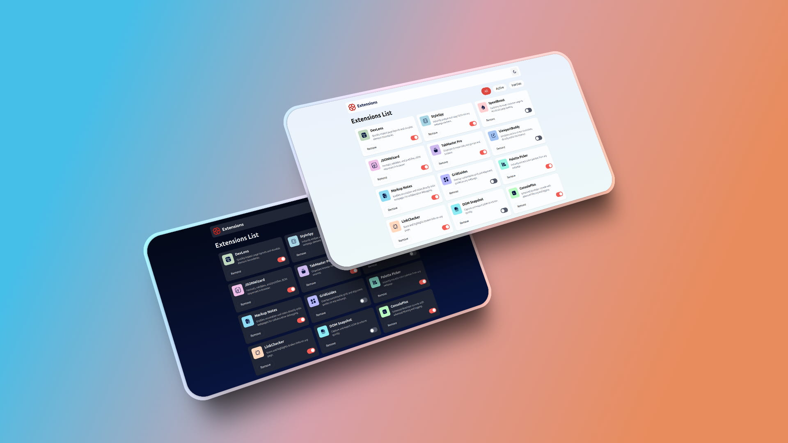

# 💻 Browser extension manager UI - FontendMentor Challenger
### project by *Manuel Denis Developer*

Responsive UI challenge for managing browser extensions, built with React, Vite, JavaScript and Tailwind CSS. Includes dark mode and full component logic.

Desafío de interfaz de usuario adaptable para gestionar extensiones de navegador, desarrollado con React, Vite, JavaScript y Tailwind CSS. Incluye modo oscuro y lógica de componentes completa.

## 📸 Preview

    

## 🚀 Technologies used

- Vite
- HTML 
- Tailwind CSS
- JavaScript
- React

## 📦 Installation and use

```bash
npm install
npm run dev
```

## 🎯 Original challenge

Este proyecto es un reto de [Frontend Mentor](https://www.frontendmentor.io) — [ver reto aquí](https://www.frontendmentor.io/challenges/browser-extension-manager-ui-yNZnOfsMAp)

## 🧠 What I learned

- Create responsive interfaces with a mobile-first approach using Tailwind CSS
- Implement dark mode with Tailwind and React logic
- Compose interfaces with reusable components in React
- Add and manage dynamic stateful filters in React
- Organize a modern project with Vite as a bundler

- Crear interfaces responsive con enfoque mobile-first usando Tailwind CSS
- Implementar dark mode con Tailwind y lógica React
- Componer interfaces con componentes reutilizables en React
- Añadir y gestionar filtros dinámicos con estado en React
- Organizar un proyecto moderno con Vite como bundler

## 🔒 License

Distributed under the MIT license.

## 👨‍💻 About me

Front-end developer passionate about creating clean, functional, and accessible interfaces. This project is part of my ongoing learning process through Frontend Mentor challenges.

Desarrollador frontend apasionado por crear interfaces limpias, funcionales y accesibles. Este proyecto forma parte de mi aprendizaje constante con retos de Frontend Mentor.

- 🌐 Portafolio: [manueldenis.netlify.app](https://manueldenis.netlify.app/)
- 💼 LinkedIn: [linkedin.com/in/manueldenisdev](https://www.linkedin.com/in/manueldenisdev/)


## 📚 My projects

### 🧩 Frontend Mentor Challenges

| Proyecto | Repositorio | Sitio Deploy |
|----------|-------------|--------------|
| Browser Extensions Manager | [Ver repo](https://github.com/madendev/frontendmentor-challenges/tree/main/01-browser-extensions-manager-ui-main) | [Ver sitio](https://01-browser-extensions-manager-ui-ma.vercel.app/) |

### 🖥️ Clones de sitios reales

| Proyecto | Repositorio | Sitio Deploy |
|----------|-------------|--------------|
| Spotify Clone | [Ver repo](https://github.com/madendev/2024-09-23-spotify-clone) | [Ver sitio](https://manueldenis-spotify.netlify.app/) |
